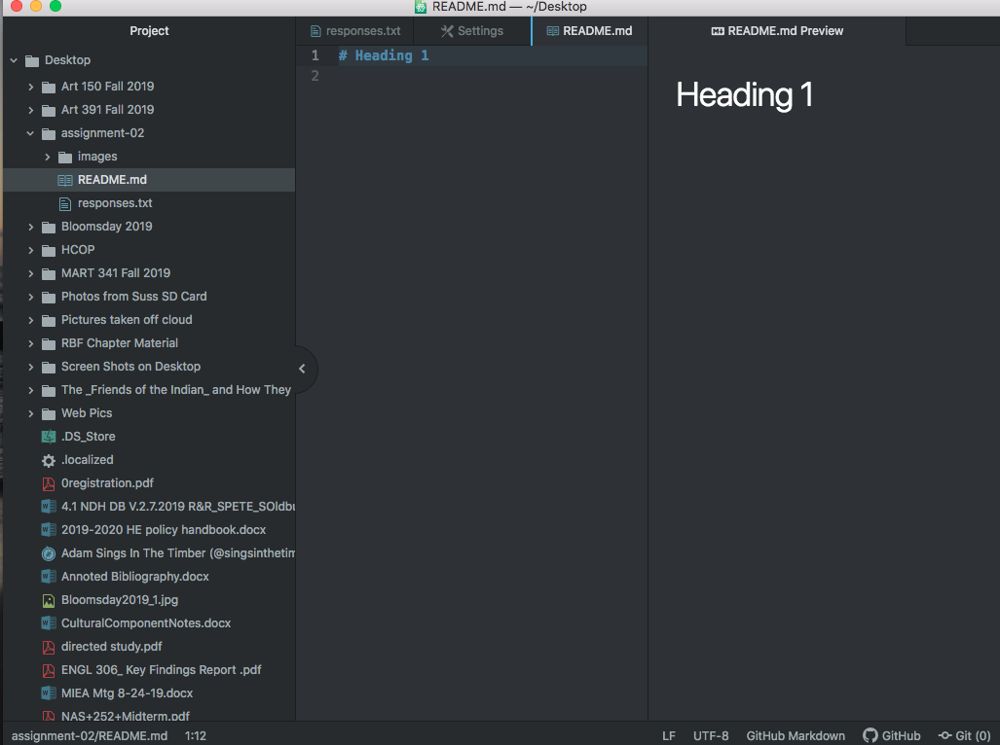

# Assignment 2
## Salisha Old Bull

I decided to take this class because it was recommended as a good course for my program curriculum. I am also interested in learning what

types of new skills can be acquired. 

Three things I've learned so far:

- How to make a Heading 1
- How to make letters bold and italic using markdown
- How to pay attention to file names and that the internet is case sensitive

I don't visit this site because it is new, but Jamie Okuma is an artist I admire:

[Jamie Okuma](https://www.jokuma.com/)

[My Responses](./responses.txt)

