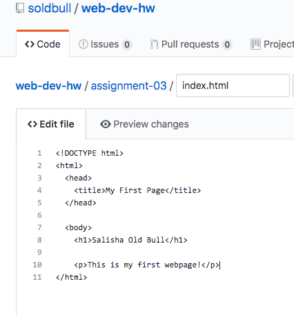

browsers function by using a translator to read javascript.

The browser reads the html from the DOM and this helps it to decide

how to structure the website.

I was never a web developer and so I just once used firefox.

I also used safari and use it on my phone.

I use google chrome on my computer because all other browsers

do not compare.

A markup language is what a browser uses to decide where to arrange

items on a webpage. An example is xhtml.

