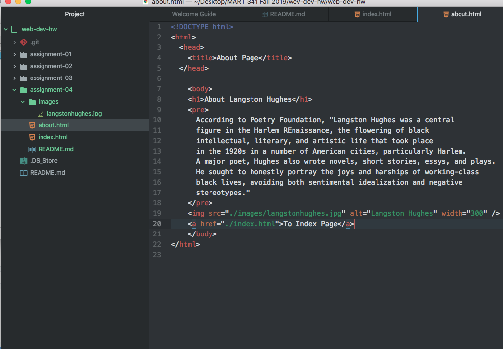

# Assignment 04

## Salisha Old Bull

In Way Back Machine I visited The University of Montana's

Webpage from the year 2000. It looked very simple with no options.

I visited the Cyberbear login site and there were only four options.

It has changed drastically, as Cyberbear is now apart of my.umt.edu

where there are many choices amongst logging into Cyberbear.

My experience with the Github module was complicated but the walkthrough

assisted in my understanding. I've struggled this far and I hope things

will get easier now that I have the desktop app.

