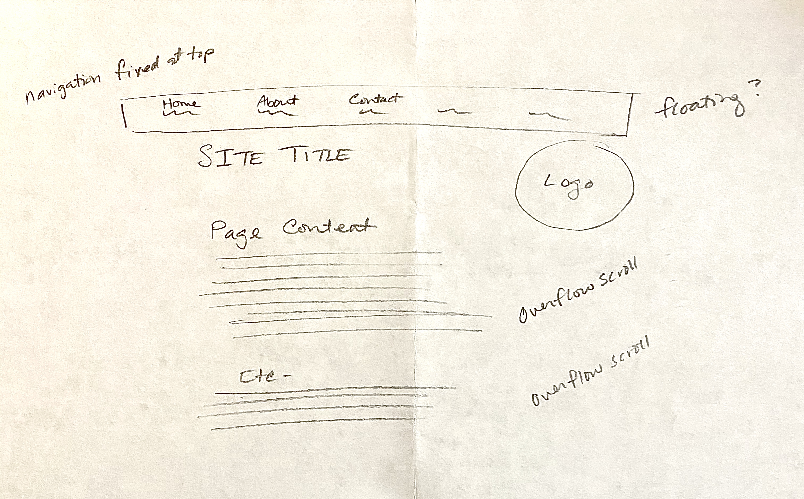

# Assignment 10

## Salisha Old Bull

## What is the difference between padding, margin, and borders?

Padding is the pixels that are around text. Margin is the area around a box/div. Borders are the lines that are surrounding the shape of the div.

## Embed the image of your sketch. image icon

## Free Response: Summarize your work cycle for this assignment.

This was the hardest assignment yet. I think I may need a to schedule an appointment
to make sure I'm on track. I'm not quite grasping the order of code used in css and
so I can't understand how to make all of my ideas work together. But I was definitely wishing
for a walk through video on this one. Reading and seeing are two very different
learning styles. All of the information prior to this was accompanied by your videos
and they were extremely helpful. Reading through, without seeing the code put into
place and the voice-over really helps me to obtain information and to figure out
how to apply what I've just read. In the end, I'm pretty sure there was css material
that didn't take effect because I probably had in the wrong order or format.
